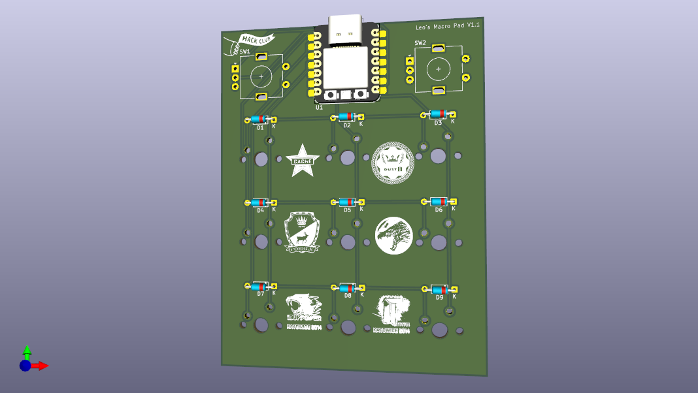

# My Hackpad Project

## Description
A custom 3x3 mechanical macropad powered by the Seeed XIAO RP2040 using KMK Firmware. Designed to fit the Hack Club grant requirements.

## Features
* **MCU:** Seeed XIAO RP2040.
* **Layout:** 3x3 Switch Matrix + 2 Rotary Encoders.
* **Case Style:** Skeleton / PCB Mount.

## Bill of Materials (BOM)
* 1x Seeed XIAO RP2040
* 9x MX-Style Switches
* 2x EC11 Rotary Encoders
* 9x 1N4148 Diodes
* 3D Printed Case (Optional/Skeleton)

## Gallery

### Assembled View

### Schematic

### PCB Layout

