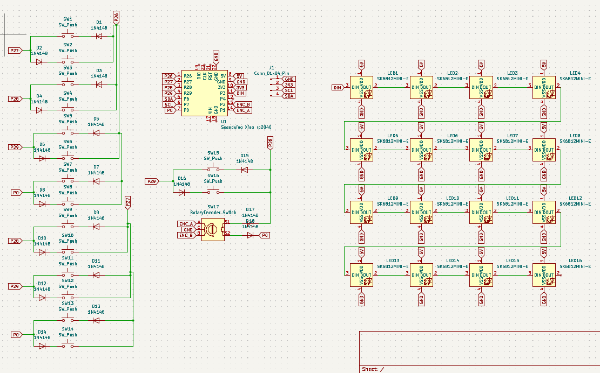
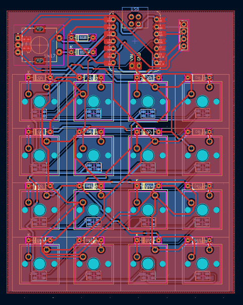
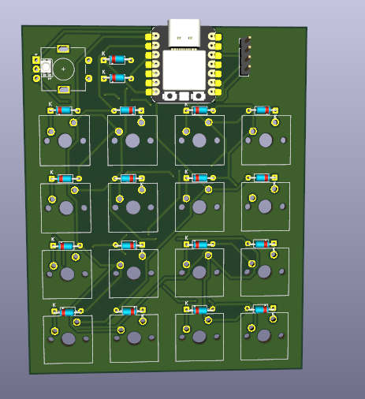
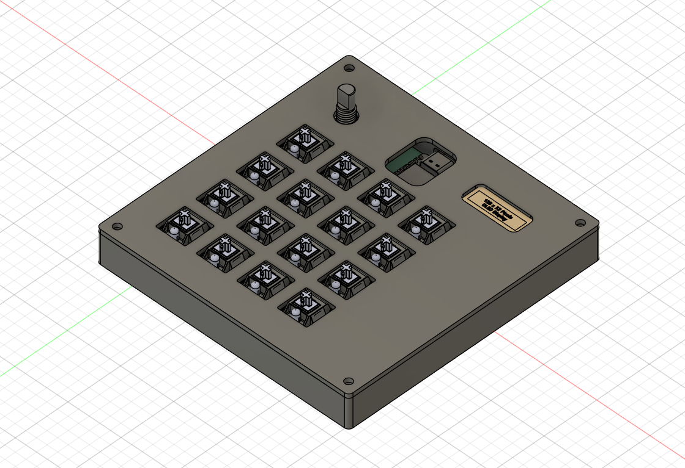
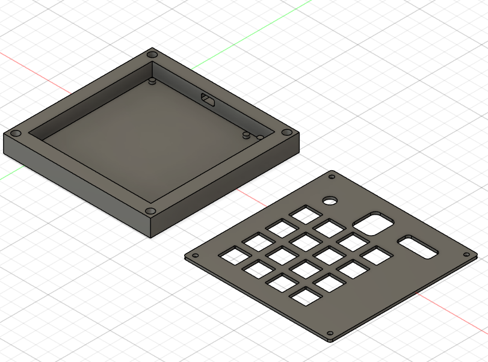

# [Macro Pad 4x4]
Hello! This is my submission for hackpad! This was made for Hackpad v1.

## Features
- 16x Mechanical MX Switches (4x4 Matrix)
- A smooth EC11 Rotary Encoder for volume/scrolling
- A crisp 0.91" OLED screen (128x32) for info and cat gifs
- Underglow RGB lighting (SK6812 MINI-E)
- Powered by Seeed XIAO RP2040
- KMK firmware! Fully programmable layers

## PCB
Here are pictures of my pcb design:

| **Schematic** | **PCB** |
|---------------|---------|
|||

I designed this to be compact but functional. The routing was a challenge but I learned a lot about KiCad!

[x] I ran DRC and there are 0 errors

## CAD
Designed using Autodesk Fusion 360!

It was a learning curve moving to 3D modeling, but I managed to create a case that snaps together (or uses screws). The OLED and Encoder fit perfectly in the top plate.

Everything fits together with standard M3 screws.

## Firmware

I wrote the firmware using KMK, you can see it inside the `Firmware` folder in this repo. It handles the matrix scanning, the encoder logic, and the OLED display.

## Notes
Making this pad was an amazing journey. I started not knowing much about Fusion 360 or advanced PCB routing, but with some help, I got to this final version. I was worried about the OLED placement, but the measurements turned out correct!

## BOM
- 1x Seeed XIAO RP2040
- 16x MX Style Switches
- 16x 1N4148 Diodes
- 1x EC11 Rotary Encoder + Knob
- 1x SSD1306 0.91" OLED Display (I2C)
- 16x SK6812 MINI-E LEDs (for underglow)
- 3D Printed Case (PLA/PETG)

- M3 Screws and Nuts

